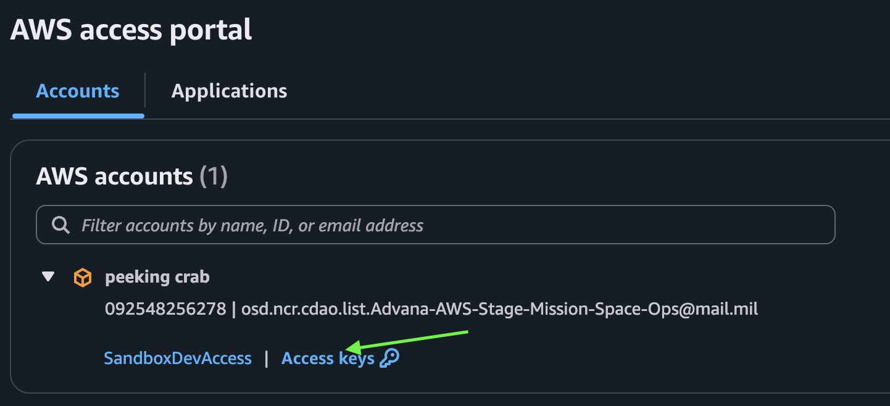
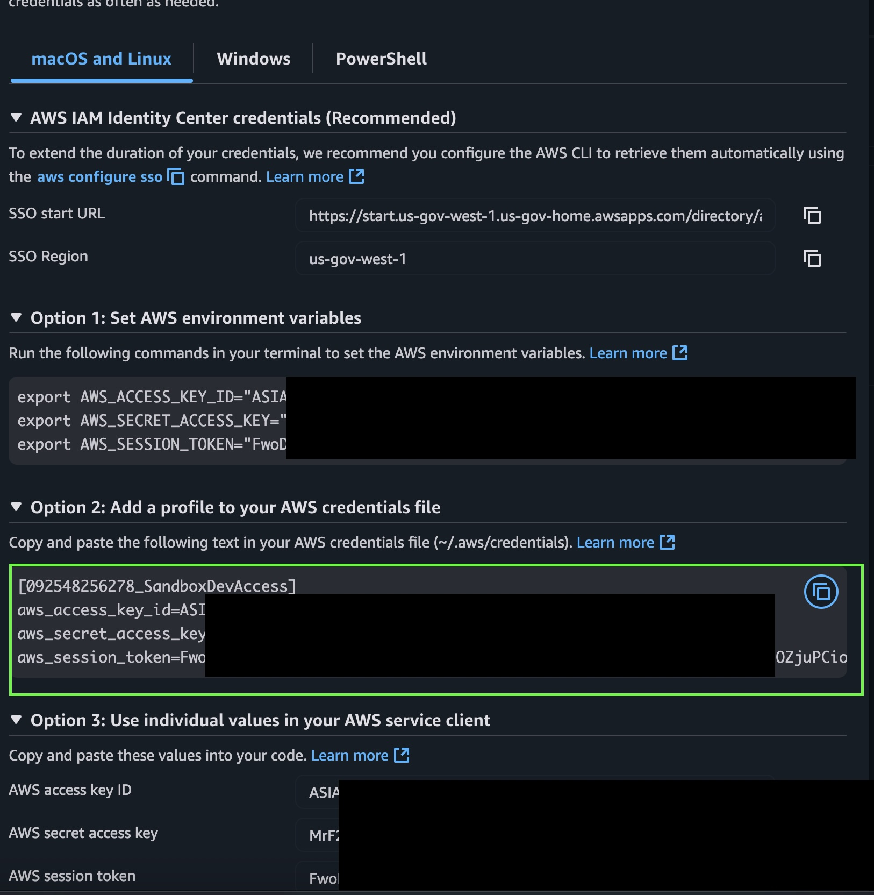

# Application Configuration Guide

This section provides detailed instructions and references for configuring the application, as required for deployment, security, and operational best practices.

---

## Configuration Topics

- **Encryption Settings:**
   - Data in transit: TLS 1.2+ required, TLS 1.3 preferred, FIPS-approved ciphers, Istio STRICT mTLS enforced. Backend DB connections require `PG_SSL_REQUIRE=true` and `NODE_EXTRA_CA_CERTS=/etc/ssl/certs/ca-bundle.crt`.
   - Data at rest: AWS RDS encryption via AWS KMS (AES-256).

- **PKI Certificate Configuration Settings:**
   - TLS certificates are stored in the Kubernetes secret `advana-marketplace-tls` and mounted to `/etc/pki/tls/certs/tls.crt`, `/etc/pki/tls/private/tls.key`, and `/etc/ssl/certs/ca-bundle.crt`.
   - Certificates must be DoD CA-signed, RSA 2048-bit or ECC equivalent, with SAN entries required.

- **Password Settings:**
   - Human passwords are managed by Keycloak IdP with policies: 15+ characters, upper/lower/number/symbol, MFA if required.
   - System passwords are generated via Terraform and stored only in AWS Secrets Manager.

- **Auditing Configuration:**
   - Backend uses Winston JSON logs with 30-day rolling retention.
   - Audit events include authentication failures, authorization denials, admin actions, and token introspection failures.
   - SQL logging is enabled in DEV only.

- **Active Directory (AD) Configuration:**
   - DoD AD Group → Keycloak Role → Application Role mapping.
   - Keycloak OIDC Authorization Code Flow is used for authentication.

- **Backup and Disaster Recovery Settings:**
   - AWS RDS automated backups with PITR enabled.
   - Stateless containers are redeployed via CI/CD.
   - RTO: < 1 hour; RPO: RDS-defined (typically minutes).

- **Hosting Enclaves & Network Requirements:**
   - Environments: Development, Staging, Production (IL2 & IL5) in AWS GovCloud (us-gov-west-1).
   - Inbound: 443 → ALB → Istio ingress → Application Pods.
   - Outbound: Keycloak (443), PostgreSQL (5432), AWS Secrets Manager, AWS ECR.

- **Deployment Configuration Settings:**
   - Kubernetes: Rolling deployments, non-root UID, read-only filesystem, resource requests & limits.
   - Environment variables (backend): `KEYCLOAK_BASE_URL`, `KEYCLOAK_REALM`, `PG_HOST`, `PG_SSL_REQUIRE`.
   - Environment variables (frontend): `VITE_API_BASE_URL`, `VITE_KEYCLOAK_URL`, `VITE_KEYCLOAK_REALM`.
   - Container security: Distroless images, FIPS compliant, no shell.
   - See also: `docker-compose.yml`, `nginx.conf`, and Helm charts in `chart/` directory.

- **Security Assumptions, Implications, and Best Practices:**
   - TLS required for all connections, FIPS runtime, Pod Security Standards (Restricted).
   - Known security assumptions: All secrets are managed in AWS Secrets Manager; all traffic is encrypted in transit and at rest; only approved DoD CA certificates are used.

## Development, Build, and Test Systems

- **List of Systems:**
   - Development: macOS/Linux, Node.js 20+, Docker, VS Code.
   - Build: GitLab CI/CD, kaniko image build, SAST scanning.
   - Testing: Vitest, Playwright, review environments.

- **Compiler and Build Tool Versions:**
   - Node.js 20+
   - Vite (frontend build)
   - Docker (container build)
   - kaniko (CI/CD image build)

- **Build Options:**
   - Rolling deployments, non-root UID, read-only filesystem, resource requests & limits (Kubernetes).
   - SAST scanning enabled in CI/CD.

- **COTS Software Versions:**
   - AWS RDS PostgreSQL (managed service)
   - Keycloak (IdP)
   - NGINX (FIPS)

- **Operating Systems and Versions:**
   - macOS/Linux for development
   - AWS EKS (Amazon Linux) for hosting

- **Supported Browsers (for Web Applications):**
   - Chrome (latest)
   - Edge (latest)
   - Firefox (latest)
   - Safari (latest)

## Configuration Topics

- **Encryption Settings:**
   - _[Document encryption algorithms, keys, and storage locations here. Add references to any relevant scripts or configuration files.]_

- **PKI Certificate Configuration Settings:**
   - _[Describe how to configure PKI certificates, including file locations and renewal procedures.]_

- **Password Settings:**
   - _[List password policies, storage mechanisms, and rotation procedures.]_

- **Auditing Configuration:**
   - _[Explain how auditing is enabled, what is logged, and where logs are stored.]_

- **Active Directory (AD) Configuration:**
   - _[Describe AD integration, including connection settings and required permissions.]_

- **Backup and Disaster Recovery Settings:**
   - _[Document backup schedules, storage locations, and recovery procedures.]_

- **Hosting Enclaves & Network Requirements:**
   - _[List hosting environments, network zones, firewall rules, and connection requirements.]_

- **Deployment Configuration Settings:**
   - _[Summarize deployment options, environment variables, and configuration files. See also: `docker-compose.yml`, `nginx.conf`, and Helm charts in `chart/` directory.]_

- **Security Assumptions, Implications, and Best Practices:**
   - _[Document known security assumptions, system-level protections, and required permissions.]_

## Development, Build, and Test Systems

- **List of Systems:**
   - _[Document development, build, and test environments, including hostnames or descriptions.]_

- **Compiler and Build Tool Versions:**
   - _[List compilers, build tools, and their versions used in the project.]_

- **Build Options:**
   - _[Document build options and flags used for application and component creation.]_

- **COTS Software Versions:**
   - _[List commercial off-the-shelf software and versions used as part of the application.]_

- **Operating Systems and Versions:**
   - _[Document supported operating systems and their versions.]_

- **Supported Browsers (for Web Applications):**
   - _[List supported browsers and versions.]_

## Additional References

- [API Configuration Guide](frontend/API_CONFIG_GUIDE.md)
- [Environment Validation Guide](frontend/ENVIRONMENT_VALIDATION_GUIDE.md)
- [Production Authentication Setup](frontend/PRODUCTION_AUTH_SETUP.md)
- [Token Passing Guide](frontend/TOKEN_PASSING_GUIDE.md)
- [User Roles Setup](frontend/USER_ROLES_SETUP.md)

> **Note:** This guide is a living document. Please update with additional configuration details as they become available or as the application evolves.
# Advana-Marketplace

A React-based marketplace application served with nginx.

## 📚 Documentation

- [Architecture Decision Records (ADRs)](docs/adr/README.md) - Key architectural decisions and their context

## Architecture

This application uses:

- **Frontend**: React with TypeScript, built with Vite
- **Server**: nginx for serving static files
- **Containerization**: Docker with nginx:alpine base image

## Development

### Prerequisites

- Node.js >= 16.17.0
- npm >= 8.0.0
- Docker (for containerized deployment)

### Local Development

#### ECR Login

Pulling containers from ECR is necessary so that the exact containers used in Advana Kubernetes is what is being troubleshot and validated locally

1. Get AWS credentials. There are several ways to do this, but once you log into AWS, click on the link for **access keys** as shown here

   

1. Next, you can choose any way to get your credentials, in this example, I added the credentials shown to my ~/.aws/config file

   

1. Now login to ECR

   ```bash
   aws ecr get-login-password --region us-gov-west-1 --profile SandboxDevAccess-092548256278 | docker login --username AWS --password-stdin 231388672283.dkr.ecr.us-gov-west-1.amazonaws.com
   ```

1. Try to pull the node image

   ```bash
   docker pull 231388672283.dkr.ecr.us-gov-west-1.amazonaws.com/cgr.dev/odcfo-advana-bah/node-fips:22
   ```

1. **Install dependencies and start development server:**

   ```bash
   cd frontend
   npm install
   npm run dev
   ```

1. **Build for production:**

   ```bash
   npm run build
   ```

1. **Preview production build locally:**

   ```bash
   npm run preview
   ```

### Docker Deployment

1. **Build the Docker image:**

   ```bash
   docker build -t advana-marketplace .
   ```

1. **Run the container:**

   ```bash
   docker run -p 8080:8080 advana-marketplace
   ```

1. **Access the application:**

   Open <http://localhost:8080> in your browser


### Available Scripts

From the root directory:

- `npm run dev` - Start frontend development server
- `npm run build` - Build frontend for production
- `npm run preview` - Preview production build
- `npm run docker:build` - Build Docker image
- `npm run docker:run` - Run Docker container

### Code Quality & Analysis

#### SonarQube Analysis

This project uses SonarQube for code quality and security analysis.

**Quick Start:**

```bash
# Setup (first time only)
source .env.sonar

# Run analysis
cd frontend
npm run sonar
```

**Available Commands:**

- `npm run sonar` - Full analysis (runs tests + coverage + scan)
- `npm run sonar:quick` - Quick scan only (requires existing coverage)

📖 **[Complete SonarQube Setup Guide](./SONARQUBE_COMPLETE_GUIDE.md)** - Comprehensive documentation for setup, configuration, and troubleshooting.

**View Results:** [SonarQube Dashboard](https://sonarqube.cdao.us/dashboard?id=tenant-metrostar-advana-marketplace)

#### Testing & Coverage

- `npm run test` - Run all tests
- `npm run test:coverage` - Run tests with coverage report
- `npm run test:watch` - Run tests in watch mode
- `npm run test:a11y` - Run accessibility tests
- `npm run lint` - Run ESLint

### Project Structure

```text
├── frontend/           # React application
│   ├── src/
│   │   ├── components/ # React components
│   │   ├── pages/      # Page components
│   │   └── styles/     # SCSS styles
│   ├── public/         # Static assets
│   └── dist/           # Build output
├── nginx.conf          # nginx configuration
├── Dockerfile          # Container definition
└── chart/              # Kubernetes Helm chart
```

## Getting started

To make it easy for you to get started with GitLab, here's a list of recommended next steps.

## Add your files

- [ ] [Create](https://docs.gitlab.com/ee/user/project/repository/web_editor.html#create-a-file) or [upload](https://docs.gitlab.com/ee/user/project/repository/web_editor.html#upload-a-file) files
- [ ] [Add files using the command line](https://docs.gitlab.com/ee/gitlab-basics/add-file.html#add-a-file-using-the-command-line) or push an existing Git repository with the following command:

```bash
cd existing_repo
git remote add origin https://code.cdao.us/tenant/metrostar/advana-marketplace.git
git branch -M main
git push -uf origin main
```

## Integrate with your tools

- [ ] [Set up project integrations](https://code.cdao.us/tenant/metrostar/advana-marketplace/-/settings/integrations)

## Collaborate with your team

- [ ] [Invite team members and collaborators](https://docs.gitlab.com/ee/user/project/members/)
- [ ] [Create a new merge request](https://docs.gitlab.com/ee/user/project/merge_requests/creating_merge_requests.html)
- [ ] [Automatically close issues from merge requests](https://docs.gitlab.com/ee/user/project/issues/managing_issues.html#closing-issues-automatically)
- [ ] [Enable merge request approvals](https://docs.gitlab.com/ee/user/project/merge_requests/approvals/)
- [ ] [Set auto-merge](https://docs.gitlab.com/ee/user/project/merge_requests/merge_when_pipeline_succeeds.html)

## Test and Deploy

Use the built-in continuous integration in GitLab.

- [ ] [Get started with GitLab CI/CD](https://docs.gitlab.com/ee/ci/quick_start/index.html)
- [ ] [Analyze your code for known vulnerabilities with Static Application Security Testing (SAST)](https://docs.gitlab.com/ee/user/application_security/sast/)
- [ ] [Deploy to Kubernetes, Amazon EC2, or Amazon ECS using Auto Deploy](https://docs.gitlab.com/ee/topics/autodevops/requirements.html)
- [ ] [Use pull-based deployments for improved Kubernetes management](https://docs.gitlab.com/ee/user/clusters/agent/)
- [ ] [Set up protected environments](https://docs.gitlab.com/ee/ci/environments/protected_environments.html)

---

## Contributing

For information on how to contribute to this project, please contact the Marketplace Engineering team.
