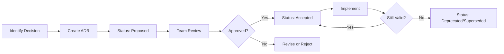

# Architecture Decision Records (ADRs)

This directory contains Architecture Decision Records for the Advana Marketplace project.

## What is an ADR?

An Architecture Decision Record (ADR) captures an important architectural decision made along with its context and consequences. ADRs help teams:

- Document the reasoning behind architectural choices
- Provide historical context for future team members
- Enable better decision-making through structured analysis
- Support compliance and audit requirements

## ADR Format

Each ADR follows a consistent structure:

- **Context**: Background and problem statement
- **Decision**: The choice that was made
- **Options Considered**: Alternative approaches evaluated
- **Rationale**: Why this decision was made
- **Consequences**: Expected outcomes and tradeoffs
- **Compliance & Traceability**: Related tickets and documentation
- **Risks**: Potential issues and mitigation strategies
- **Open Questions**: Unresolved items for future consideration
- **Next Steps**: Action items following the decision

## Creating a New ADR

```bash
# Using the bash script
./create-adr.sh "Your ADR Title" [--accepted|--proposed|--deprecated|--superseded]

# Using the TypeScript version (requires Node.js)
./create-adr.ts "Your ADR Title" [--accepted|--proposed|--deprecated|--superseded]
```

## ADR Index

| # | Title | Status | Date | Author |
|---|-------|--------|------|--------|
| 0001 | [ServiceNow API Integration Location (Frontend vs Backend)](0001-servicenow-api-integration-location.md) | ✅ Accepted | 2025-11-18 | Marketplace Engineering Team   |

## ADR Workflow



## Status Definitions

- **🔄 Proposed**: The ADR is under review and not yet approved
- **✅ Accepted**: The decision has been approved and is in effect
- **⚠️ Deprecated**: The decision is no longer recommended but may still be in use
- **🔁 Superseded**: The decision has been replaced by a newer ADR

## Tools

This directory includes several helper scripts:

- `create-adr.sh` - Bash script to create new ADRs with auto-numbering
- `create-adr.ts` - TypeScript/Node.js version of the ADR creation script
- `generate-adr-index.sh` - Generate this README index
- `supersede-adr.sh` - Mark an ADR as superseded

## References

- [ADR GitHub Organization](https://adr.github.io/)
- [Documenting Architecture Decisions](https://cognitect.com/blog/2011/11/15/documenting-architecture-decisions)
- [Advana Software Operations Playbook](https://internal-link-to-playbook)

---

_Last generated: 2025-11-26 11:07:04_
