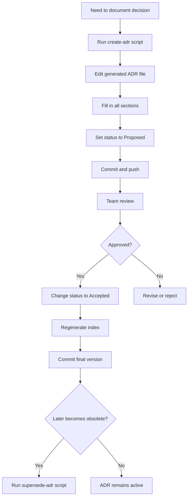

# ADR Tooling Guide

This directory contains a complete tooling suite for managing Architecture Decision Records (ADRs) in the Advana Marketplace project.

## 🛠️ Available Tools

### 1. ADR Creation Scripts

#### Bash Version
```bash
./create-adr.sh "Your ADR Title" [--accepted|--proposed|--deprecated|--superseded]
```

**Examples:**
```bash
# Create a new proposed ADR (default)
./create-adr.sh "Database Migration Strategy"

# Create an accepted ADR
./create-adr.sh "API Gateway Implementation" --accepted

# Create a deprecated ADR
./create-adr.sh "Legacy Auth System" --deprecated
```

#### TypeScript/Node.js Version
```bash
./create-adr.ts "Your ADR Title" [--accepted|--proposed|--deprecated|--superseded]

# Or using ts-node
npx ts-node create-adr.ts "Your ADR Title" --accepted
```

**Features:**
- ✅ Automatic sequential numbering (0001, 0002, ...)
- ✅ Custom status flags (Proposed, Accepted, Deprecated, Superseded)
- ✅ Templated structure matching existing ADRs
- ✅ Current date auto-insertion
- ✅ Filename generation from title

### 2. README Index Generator

```bash
./generate-adr-index.sh > README.md
```

**Features:**
- 📋 Generates complete table of contents for all ADRs
- 📊 Includes status badges (✅ Accepted, 🔄 Proposed, ⚠️ Deprecated, 🔁 Superseded)
- 📅 Extracts date, author, and title from each ADR
- 📖 Includes usage instructions and workflow diagram
- 🔄 Easy to regenerate after changes

### 3. Supersede ADR Script

```bash
./supersede-adr.sh <old-adr-number> <new-adr-number> ["Reason"]
```

**Examples:**
```bash
# Basic usage
./supersede-adr.sh 0001 0003

# With custom reason
./supersede-adr.sh 0001 0003 "New architecture requires different approach"
```

**What it does:**
1. ✅ Changes old ADR status to "Superseded"
2. ✅ Adds supersession notice banner to old ADR
3. ✅ Adds reference in new ADR showing it supersedes the old one
4. ✅ Creates backups of both files in `.backups/` directory
5. ✅ Provides clear summary of changes

### 4. VS Code Snippets

To use the snippets in VS Code:

1. **Copy to workspace settings** (recommended for team):
   ```bash
   mkdir -p ../../.vscode
   cp adr-snippets.code-snippets ../../.vscode/
   ```

2. **Or copy to user snippets** (personal only):
   - Open VS Code
   - Press `Cmd+Shift+P` (Mac) or `Ctrl+Shift+P` (Windows/Linux)
   - Type "Snippets: Configure User Snippets"
   - Select "markdown.json"
   - Copy content from `adr-snippets.code-snippets`

**Available Snippets:**

| Prefix | Description |
|--------|-------------|
| `adr-full` | Complete ADR template |
| `adr-header` | ADR header with metadata |
| `adr-context` | Context section |
| `adr-decision` | Decision section |
| `adr-options` | Options Considered section with pros/cons tables |
| `adr-rationale` | Rationale section |
| `adr-consequences` | Consequences section |
| `adr-compliance` | Compliance & Traceability section |
| `adr-risks` | Risks section |
| `adr-questions` | Open Questions section |
| `adr-nextsteps` | Next Steps section |
| `adr-proscons` | Pros/Cons comparison table |
| `adr-superseded` | Superseded notice banner |

**Usage in VS Code:**
1. Open a markdown file
2. Type the prefix (e.g., `adr-context`)
3. Press `Tab` to expand
4. Fill in the placeholders

## 📋 ADR Template Structure

Each ADR follows this structure:

```markdown
# ADR XXXX: Title

**Date:** YYYY-MM-DD
**Status:** Proposed | Accepted | Deprecated | Superseded
**Author:** Advana Marketplace Team

---

## Context
[Background and problem statement]

## Decision
[The choice that was made]

## Options Considered
[Alternative approaches with pros/cons]

## Rationale
[Why this decision was made]

## Consequences
[Expected outcomes and tradeoffs]

## Compliance & Traceability
[Related tickets and documentation]

## Risks
[Potential issues and mitigation]

## Open Questions
[Unresolved items]

## Next Steps
[Action items]
```

## 🔄 Typical Workflow



## 🎯 Quick Start

### Create your first ADR:
```bash
cd docs/adr
./create-adr.sh "My First Decision"
# Edit the generated file
# Update the README index
./generate-adr-index.sh > README.md
```

### Supersede an old ADR:
```bash
# First create the new ADR
./create-adr.sh "Improved Approach to Previous Decision"

# Then supersede the old one
./supersede-adr.sh 0001 0002 "Better solution found"

# Update the index
./generate-adr-index.sh > README.md
```

## 📝 Best Practices

1. **Always use the scripts** - Ensures consistent numbering and formatting
2. **Start with Proposed** - Use `--proposed` or accept the default, change to `--accepted` after approval
3. **Be thorough** - Fill in all sections, even if some are brief
4. **Link related work** - Reference tickets, PRs, and related ADRs
5. **Update the index** - Run `generate-adr-index.sh` after changes
6. **Use snippets** - Speed up editing with VS Code snippets
7. **Commit ADRs separately** - One ADR per commit for clear history

## 🔧 Installation & Setup

### Prerequisites

**For Bash scripts:**
- Bash shell (available on macOS/Linux by default)
- Standard Unix utilities (grep, sed, awk)

**For TypeScript script:**
- Node.js (v14 or higher)
- TypeScript (install globally or use ts-node)

```bash
# Install TypeScript globally (optional)
npm install -g typescript ts-node

# Or run with npx
npx ts-node create-adr.ts "Title"
```

### Make scripts executable:
```bash
chmod +x create-adr.sh
chmod +x create-adr.ts
chmod +x generate-adr-index.sh
chmod +x supersede-adr.sh
```

## 📚 Resources

- [ADR GitHub Organization](https://adr.github.io/)
- [Documenting Architecture Decisions](https://cognitect.com/blog/2011/11/15/documenting-architecture-decisions)
- [When to Use ADRs](https://docs.aws.amazon.com/prescriptive-guidance/latest/architectural-decision-records/when-to-use-adrs.html)

## 🤝 Contributing

When adding new ADR tools:
1. Follow the existing naming conventions
2. Make scripts executable
3. Update this README
4. Test thoroughly before committing

## 📞 Support

For questions about ADRs or these tools:
- Ask in the #advana-marketplace Slack channel
- Consult the Advana Software Operations Playbook
- Review existing ADRs for examples

---

_Maintained by the Advana Marketplace Engineering Team_
